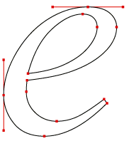
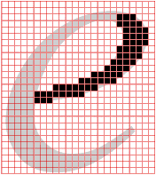

# OneTweet

This project is about about **typography** and creating *meaning with text*.

1. Choose a `tweet` (short text of up to 140 characters) from the [list below](#tweets).
* Use your chosen tweet to create a **poster**:
	
	* Text-only, no pictures 
	* 1 font-family
	* 3 colours max
	* Square format: width = height
	* *Vector* file (see [vector vs raster below](#vector-vs-raster))	
* Produce several **variations** of your poster (min 5), exploring:
 
	* Closure
	* Symmetry
	* Figure/ground relationship
	* Connectedness 
	* Proximity
	* Continuation
	* Similarity
	* Past experience   
* Create a *GitHub repository* for your project and push everything there: source files (`.ai` files), exports (`.pdf` `.png` etc.) as well as sketches, inspirations and thoughts.

### Tweets

> A Tweet is an expression of a moment or idea. It can contain text, photos, and videos. Millions of Tweets are shared in real time, every day.

* [@jack](https://twitter.com/jack/status/20) `just setting up my twttr` 

* [@kourtneykardash](https://twitter.com/kourtneykardash/status/11175751424) `Do ants have dicks?` 

* [@kimkardashian](https://twitter.com/kimkardashian/status/16511330274) `EWW Im at lunch,the woman at the table next 2 me is breast feeding her baby w no coverup then puts baby on the table and changes her diaper`
 
* [@CIA](https://twitter.com/CIA/status/474971393852182528) `We can neither confirm nor deny that this is our first tweet.` 

* [@Snowden](https://twitter.com/Snowden/status/648890134243487744) `Can you hear me now?`
 
* [@emmyblotnick](https://twitter.com/emmyblotnick/status/489463436418359296) `Invent a drink called "Responsibly" and your advertising is set forever` 

* [@LeicesterPolice](https://twitter.com/leicesterpolice/status/287937337781002240) `Not a scam: If you’ve committed a burglary in the #Leicester area within the last week - come to our #police station & claim a FREE iPad.`

* [@edballs](https://twitter.com/edballs/status/63623585020915713) `Ed Balls`

<!-- 

* [@]() `` 

* [@]() ``
 
* [@]() `` 

-->

<!--We're so used to the things we see every day that we sometimes forget to *look* at them, and realise that there are many different *perspectives* from which we can observe them and *capture* their appearances.

[Ditched in a ditch](https://www.flickr.com/photos/munkimunki/20731621044/in/pool-facesinplaces/) by Munki Munki

We'll look at everyday objects and our surroundings with different eyes and use **photography** to *frame* them, so that others can see what we want them to see.

1. Form **teams** of 2-3 people
* Look for **faces** in everyday objects and your surroundings.
* **Photograph** them. Don't take just one picture of a subject, but capture it from many different angles. The more, the better (see [criteria](#criteria) below).
* Photographs can be **edited**, in which case you must submit both the original shot and the edited image.
* Create a *GitHub repository* for your team project and **submit** all your images there. 

* **Bonus 1** Add documentation (eg: the same subject from many different angles or at different times), research and inspiration material to the GitHub repository. 
* **Bonus 2** Tweet your images, tag them with *#RaveFWD* (FWD = Fundamentals of Web Design) and cc [@RaveWebMedia](https://twitter.com/ravewebmedia).

### Criteria

When reviewing your images, we will look for: 

* **Originality** of your subject, the less *in-your-face* (obvious / common) a subject the better.
* **Manipulation**, the less you interfered with a subject the better. For instance, drawing a face on a dusty surface is not the point of this project. Arranging objects to resemble a face is ok, but we prefer *ready-made* subjects, which you simply found and framed, rather than manipulated.
* **Framing**, the point(s) of view you chose for your subject to highlight its *faceyness*. Framing an image has as much to do with what you include as what you exclude. 
* **Interpretation**, how your subject is cropped (or otherwise edited) to highlight its *faceyness*.

* [Faces in places](http://facesinplaces.blogspot.co.uk) is a photographic collection of **faces found in everyday places**, curated by [Jody Smith](https://twitter.com/ToastMaster).

* [Ways of Seeing](https://www.youtube.com/watch?v=LnfB-pUm3eI) is a BBC series (and a book) that analyse traditional Western cultural aesthetics and raise questions about hidden **ideologies in visual images**.  

### Tutorials and tools

Photography courses on Lynda.com, which you have free access to as a Ravensbourne student (go to [tinyurl.com/ravelynda](http://tinyurl.com/ravelynda)), in particular:

* You can start from [this short video](http://www.lynda.com/Photoshop-tutorials/Seeing-compositing-possibilities/374612/411110-4.html) about seeing the **possibilities** for how a scene or subject can be framed (*framing* and *composition* can be used as synonyms for the sake of our project).
* Follow this [foundation course on composition](http://www.lynda.com/Photography-Photo-Assignments-tutorials/Foundations-of-Photography-Composition/80299-2.html).
* Try this [challenge](http://www.lynda.com/course-tutorials/5-Day-Photo-Challenge-Composition/383423-2.html).-->

### Inspirations

[BauBauhaus](http://www.baubauhaus.com/) and [Typographic Posters](https://www.typographicposters.com/).

<!---->

<!---->

<!---->

<!---->

### Vector vs raster

•  | Vector | Raster
--------	| ------ | ------
Made of 	| *Paths*     | *Pixels*   
File formats | `.pdf` `.svg` `.eps`  | `.gif` `.jpg` `.png`
Made with | Photoshop `.psd` | Illustrator `.ai` 
Better for | Typography and illustration | Photography
Advantages | Can be *scaled* to be very large without losing quality |  	

<!--
# Matteo's TODO
-->