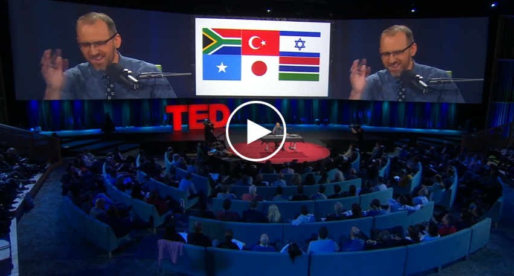
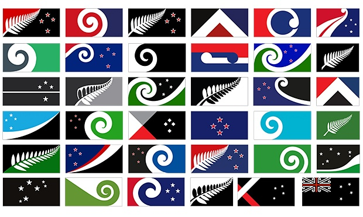
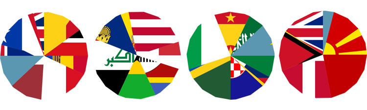
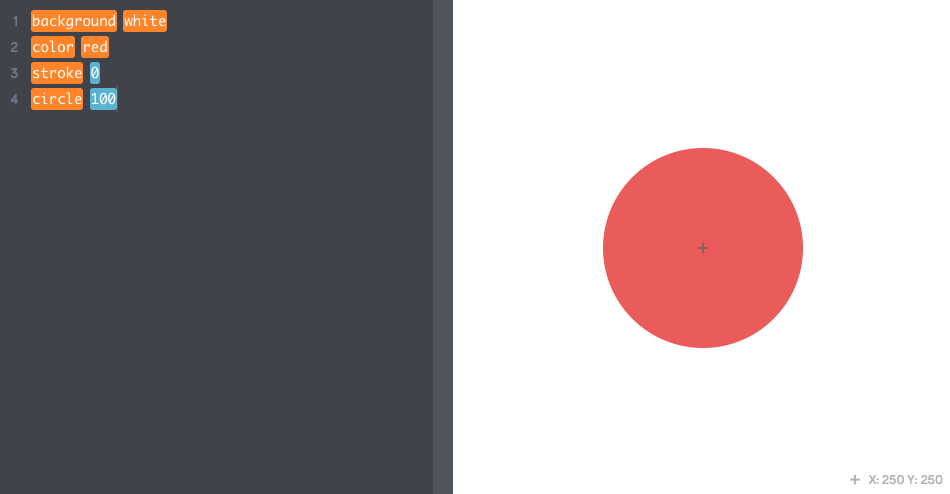

# The Union Hack

This **team project** is about *symbols* and *brands*.

Flags are powerful visual symbols, brands before *branding* was even a discipline. By designing flags, you will devise symbols to represent *identities* and convert ideas into shapes. 

First you will *mash up* existing flags, and then *make your own* flag. 

1. Form **teams** of 2-3 people.
*  Watch [this TED talk](http://www.ted.com/talks/roman_mars_why_city_flags_may_be_the_worst_designed_thing_you_ve_never_noticed) about the rules of good flag design (and some funny examples of bad flag design).
  
	
* **MASH UP** 

	Pick an existing flag and mash it up following these criteria:
	
	* Change one or more of its colours
	* Add or remove one or more elements
	* Change one or more shapes
	* Any of the above in combination 
	
	Producing minimum **4 variations** of your flag mash-up.
* **MAKE YOUR OWN**

	Pick a place (real or imaginary) and design one or more flags for it, following these criteria (the *five basic principles of flag design* by [Ted Kaye](http://portlandflag.org/good-flag-bad-flag/), cited in the TED talk above):	
	1. **Keep it simple**. The flag should be so simple that a child can draw it from memory.
	
	* **Use meaningful symbolism**. The flag’s images, colours, or patterns should relate to what it symbolises.
	
	* **Use 2 or 3 basic colours**. Limit the number of colours on the flag to three which contrast well and come from the standard colour set.
	
	* **No lettering or seals**. Never use writing on any kind or an organisation’s seal.
	
	* **Be distinctive or be related**. Avoid duplicating other flags, but use similarities to show connections.
* Create a *GitHub repository* for your team project and **submit** all your work there. 	
### Inspirations

* Mark Napier's [**net.flag**](http://marknapier.com/netflag) is a participatory piece of art, in which visitors  mash up national flags to create a *flag for the Internet*. 

 	> Every nation on earth has a flag that identifies the territory of that nation, and the flag is a symbol of conquest of new territory. 
 	
 	> An online software interface makes the visual language of international flags available to anyone with Web access. The visitor to *net.flag* not only views the flag but can change it to reflect their own nationalist, political, apolitical or territorial agenda.

	

* [What’s in a flag?](http://www.theguardian.com/commentisfree/2015/aug/11/flag-new-zealand-designs) **New Zealand** is drawing up a shortlist from an open competition to design a new national flag. 

	

* [**Citizen Ex**](http://shorttermmemoryloss.com/portfolio/project/citizen-ex/) is an extension for Web browsers which makes visible the physical infrastructure that underlies the internet, mapping the location of web sites, and visualising the user's *algorithmic citizenship*.

	
		
* [Draw flags with code](http://art.kano.me/challenge/1), by Kano.

		