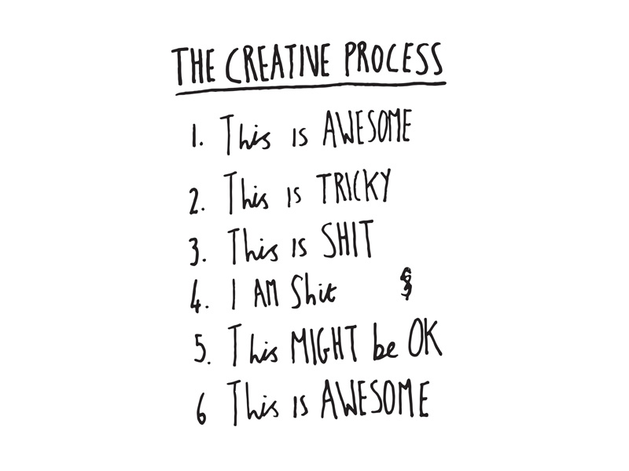

# Week 3

### Today, Wednesday 14th October 2015

1. [Peer learning](#peer-learning) on **typography** 
* Tutorials on [OneTweet](#project)   
* Team project: [The Union Hack](#team-project)

### Your [homework](#homework) and [blog](#blog)!

# Peer learning

<!-- 

Talk about transferable life skills?

Have a quick convo about feedback from last week (they should have blogged about this)

-->

<!--### Let the peer learning begin-->

#### 8 teams

~3 people per team 

#### 15 minutes per team

* ~10 for mini-lesson 
* ~5 for questions and debate

#### Mini-lessons topics

1. How do people read? 
* Typography vocabulary: anatomy of a letter
* Fonts: serif, sans-serif etc, weights and styles 
* The personality of fonts: expressive typography
* Horizontal and vertical motion: alignments, kerning, tracking and leading 
* Proportion: typographic scales
* [Web design is 95% typography](https://ia.net/know-how/the-web-is-all-about-typography-period) 
* How to choose the right font

# Project

### OneTweet tutorials

This project is about about **typography** and creating *meaning with text*.

All the project material is [here](../../projects/one-tweet).

This is *not a team project* but we'll see people in groups of 2-3, possibly grouping people who are working on the same tweet.

### 8 groups

### 15 minutes per group 

That is, ~5 minutes per person.

1. Let's see your **posters**.
* Which tweet did you choose and why?
* What variations did you produce? 
* Which visual perception principles have you explored (either alone or in combos)?
* What fonts and colours did you pick?
* What ideas could you *steal* (ehm, `fork`) from your peers?

# Homework

### Typography

1. **Publish** your mini-lesson and any other relevant material from today. We recommend GitHub (we :green_heart: :octocat:) but you can publish elsewhere as long as it's accessible by anyone.

2. Add the link to your mini-lesson and any other relevant material to the Google document I emailed you (it's also on Slack).

### Peer learning research

#### Symbols and brands

On the Google document I emailed you (you can also find it on Slack), there's a new table with topics around **symbols and brands** for you to learn and teach next week.

We'll do this again in *teams*, but not the same people you worked with this week.

Your team **mini-lesson** should be **~15 minutes** and you may include:

* **2-3 key ideas**
* **Examples** and demonstrations
* Personal **experiences**
* Other relevant things you've read, heard or seen

Prepare **1-2 open questions to ask the class**. After your mini-lesson, we will have a short group discussion around these questions.

Topics: TBA

<!--1. How do people **read**? 
* **Typography vocabulary**: anatomy of a letter  
* **Fonts**: serif, sans-serif etc, weights and styles (also check out the [type shape game](http://shape.method.ac/)) 
* The personality of fonts: **expressive typography**
* Horizontal and vertical **motion**: alignments, kerning, tracking and leading (also check out the [kerning game](http://type.method.ac/))
* **Proportion**: typographic scales
* [Web design 95% typography](https://ia.net/know-how/the-web-is-all-about-typography-period)
* How to **choose the right font** (among other things, check out [WhatFont](http://chengyinliu.com/whatfont.html))

[This means this, this means that: a user's guide to semiotics](https://learningresources.rave.ac.uk/client/en_GB/studyzone/search/detailnonmodal/ent:$002f$002fSD_ILS$002f0$002fSD_ILS:14723/one?qu=this+means+this+this+means+that&te=ILS)-->

### Project 

Work on *The Union Hack*.

### Blog 

**Individually**, write about *The Union Hack*. 

Reflect on the concept and document **your** creative process. 

You can post pictures of scribbled notes, or jot down notes digitally. It doesn't need to be fleshed out and well written. The main goal here is to record your flow of ideas, not to make it beautiful!

