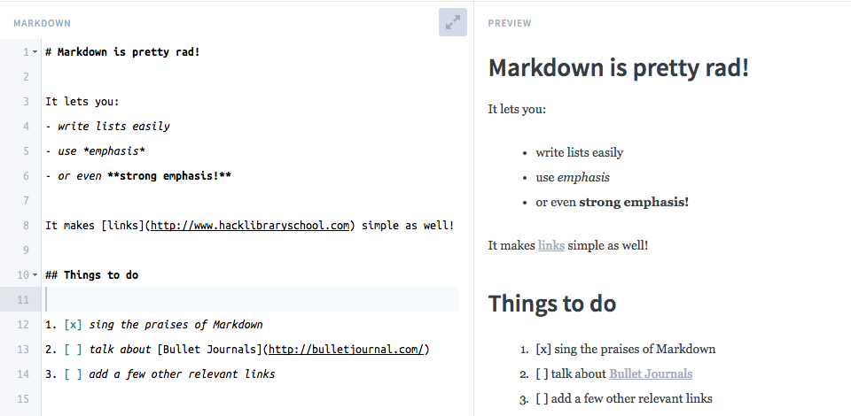

# Week 7

### Today, Wednesday 11th November 2015

1. Workshop: [gridz](#workshop)! 
*  Review of Summative Assesmet
*  Open Class Time - Let's work on any areas that need improvement (Mark Up, Hosting your projects, linking your mini lessons ect). 

### Your [homework](#homework) and [blog](#blog)

# Workshop

Look around you at all the things that are organised in grids... 

### What is a grid system?

It's a structure comprising a series of **horizontal and vertical lines** which intersect and are then used to **organise** space, text, images, and any other element placed in a design.

### Pick 3 sites you like and draw their grids on paper!

Printable templates from [InterfaceSketch](http://www.interfacesketch.com)

### Why grids?

> Designers solve problems. Web designers are faced with finding solutions to visual and organisational problems and one approach to solving these problems is the grid. It’s not the only approach you might take, but it’s one with several important benefits.

From [Why grids?](http://www.vanseodesign.com/web-design/why-grids/)

#### **Order** 

Grids can bring order to a layout and make it easier for users to find and navigate through information.
	
#### **Consistency** 

Consistent layouts can help users absorb the information we’re trying to communicate (they learn where to find it, consistently) and build a sense of familiarity
	
#### **Proportion** 

Grids offer a guide to the placement of information and help generate visual hierarchy. They promote rhythm and consistency in a design and help you develop relationships between elements based on rational proportions.

#### **Efficiency** 

Grids allow designers to quickly add elements to a layout because many layout decisions are addressed while building the grid structure.

### Useful tools when designing grid systems

* [Gridpak](http://gridpak.com/)
* [GridLover](http://www.gridlover.net/)
* [ ] [jQuery grid plugins from UnHeap](http://www.unheap.com/?s=grid)
* [ ] [MediaQuery bookmarklet](http://seesparkbox.com/foundry/media_query_bookmarklet)

# Homework

### There's code in your plate

Write the **recipe** for your favourite dish in *MarkDown* (`.md` file).

* Decide what **information** to include, so that someone else can prepare the dish you chose.

* Make thoughtful decisions about how to **structure** your recipe. 

	For instance, what structure is appropriate for the ingredients *list*? And which is appropriate for the preparation steps *list*? Don't just use paragraphs everywhere.. 

	

* Use **images** to enhance your recipe, but not to be the only carrier of important information. For example: use images to visualise something that you've already explained through text.

**Push** your `recipe.md` to a new repository on your GitHub.

### Blog 

Read and blog about [The Web's Grain](http://frankchimero.com/writing/the-webs-grain/).

When dealing with a *new* medium, we tend to use *old* metaphors in order to make sense of it. Cars were initially thought of as *horseless carriages*. The first photographs tried to replicate paintings.

Likewise, things on the Web were initially called *pages* (as if they were flippable sheets of printed paper), organised into *sites* etc.

What makes Web things **different** from other media?

How can we use the unique properties of the Web medium to our advantage (for instance, to make a **recipe** that doesn't look just like a printed page)?

# Review of Summative

What will you need to hand in for summative? [Find it all out here.] (https://github.com/RavensbourneWebMedia/Web-Design-principles/tree/2016/sessions/10#hand-in-package)

# Class Open Time

An afternoon session to work on any areas of the course so far that you think may need improvement. 

This weeks project involves writing Mark Up. If you haven't had time to go through the mark up tutorial, this would be a good use of the afternoon session. (Find the mark up tutorial here) [http://www.markdowntutorial.com/]

Each week you should have been hosting and supplying links to your mini lessons. If you haven't done this yet, this would be a good use of this afternoons time. 

If you need more time to practice photoshop and illustrator, now would be a good time. 