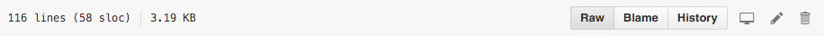
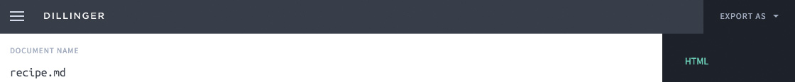

# Week 8

### Today, Wednesday 18th November 2015

1. [What is **code**?](#what-is-code) 
* [Meet **HTML**](#meet-html)
* Workshop: [HTML in your plate](#your-turn)
* [Meet **CSS**](#meet-css)
* Workshop: [CSS in your plate](#your-turn-1) 

<!-- 
- [ ] gh-pages?
-->

#### Your [homework](#homework) and [blog](#blog)

# What is **code**?

Can you fill in the blanks?

#### [...] code

Think of words/phrases that end with `code`.

<!-- *Morse code*, *post code*, *dress code*... -->

Code existed **before computers**.

Code is about

*   transmitting information
*   giving instructions
*   **communication**

If I want to talk to my **grandma**, I need to use Italian. To communicate with you, I use English. 

To **talk to a computer**, we use...

#### Code is **instructions** to a computer: extremely powerful, fundamentally thick.

### How do you learn to code?

Remember how you learned your first language as a child?

You learned your first language by copying people around you, observing their reactions to your actions.

> If I say `mum` then that one person will respond. She also responds when I cry. She doesn't respond to other names, it seems.

Learning a coding language is like **learning a new language**.

#### **Translating** your ideas into a language your computer understands

#### **Observing** how the computer responds to your inputs and adapting them until it works

**Today** you're going to learn **2 new languages**.

# Meet HTML

### `HTML` = How To Make Lunch 

#### true / false ?

> A **markup language** is a modern system for **annotating** a document in a way that is syntactically distinguishable from the text. 

> The idea and terminology evolved from the *marking up* of paper manuscripts: the revision instructions by editors, traditionally written with a blue pencil on authors' manuscripts.

> From [Wikipedia](http://en.wikipedia.org/wiki/Markup_language)

All your **digital texts** are marked up, whether you see the **markup** or not. That is, they contain both content and meta-content.

**HTML** is one of many markup languages, the one used to mark up documents (aka *hypertexts*) on the WWW. 

### `
`Hello`
`

##### `
`Hello`
`

Wanna learn all the HTML tags? [html5Doctor has a good HTML dictionary](http://html5doctor.com/element-index/).

# Your turn

We're going to use [Thimble](https://thimble.mozilla.org/), an amazing online open-source code editor, to write our favourite recipe in HTML.

1. You should have written your **recipe** as a **MD** document and published it to **GitHub**. Go find it and then click on the `Raw` button. 

	
* **Copy** your recipe's MD.
* Go to [dillinger.io](http://dillinger.io/) and paste your recipe's MD into it.
* Export it as HTML

	 
* Go to [thimble.mozilla.org](https://thimble.mozilla.org/) and sign up.
* Start a project from scratch.
* Paste your recipe's HTML between `<body>` and `</body>` (you can get rid of the default `h1` and `p`). 
* Click on any element in HTML and then <kbd>alt</kbd> + <kbd>k</kbd> to bring up a definition of that element.

Let's **focus on the HTML** (we'll use CSS to style it later). 

#### Checklist

* Does you recipe contain all the **information** necessary for someone else to prepare the dish you chose?

* Is that information **well structured**? Are you using appropriate HTML tags to mark up that information?   
  
	For instance, what structure is appropriate for the ingredients *list*? And which is appropriate for the preparation steps *list*? Don't just use `p` everywhere..

* Is your recipe's information **accessible**? Remember, not everybody (both humans and *robots*) can see your recipe.

	For example: use images to visualise something that you've already explained through text, and add `alt="DESCRIBE YOUR IMAGE HERE"` to all your `img` elements. That way, they'll be more search-engine-friendly, and accessible to people who don't consume your page visually.   

Learn more about how to use Thimble in [this tutorial](https://d157rqmxrxj6ey.cloudfront.net/baddeo/12738).

# Meet CSS

### The languages of the Web

Different **languages**, separate [**concerns**](http://en.wikipedia.org/wiki/Separation_of_concerns#HTML.2C_CSS.2C_JavaScript).

Think of a group of people working together, eg to produce a car, a newspaper, a website, to provide education. What are the different *roles* and *concerns* of these people?

#### 1. **HTML** → content and structure  

#### 2. **CSS** → style and design 

#### 3. **JS** → behaviour and logic

_BBC homepage > Using the [Web Developer tool](http://chrispederick.com/work/web-developer/), disable CSS to show the separation of concerns in action._

With CSS you can (hopefully) make your Web content clearer, easier to read and more appealing!

### Learning CSS

1. Learn how to write CSS rules.
* Understand how CSS rules apply to HTML.
* Play around with CSS properties! **Inspect** > **copy** > **hack**

### `selector { property: value; }

##### `p { color: blue; }

To understand **CSS selector**, let's play the [CSS Diner](http://flukeout.github.io) game!

### Thinking inside the **box**

Imagine that there is an **invisible box** around every HTML element. 

<!--Use Web Inspector to demonstrate it-->

Your browser likes to put code into boxes, boxes inside boxes inside boxes inside boxes...

Each HTML box has:

* margin
* border
* padding

# Your turn

Using CSS, style your HTML recipe. 

This exercise is about making your **texts** easy to scan and easy to read, informative and usable.

Today we're focusing on:

* good **typography**, use this [Web typography checklist](http://www.merttol.com/articles/web/checklist-for-better-web-typography.html)
* **colours**, use [this colour contrast and difference checker](http://snook.ca/technical/colour_contrast/colour.html)

Next week we're going to:

* style images
* introduce grid layouts

### CSS properties you can play around with

#### Text

* `font-family` 
* `font-size`
* `font-weight`
* `font-style`
* `line-height`
* `letter-spacing`
* `word-spacing`
* `text-align`
* `text-decoration`
* `text-transform`
* `text-indent`

#### Box 

* `margin`
* `border`
* `padding`
* `width`
* `max-width`

#### Colours

* `color`
* `background-color`

# Homework

### Peer-learning: **CSS tricks**!

On the Google document I emailed you (you can also find it on Slack), there's a new table called **CSS tricks** for you to learn and teach next week.

Your team **mini-lesson** should be **~15 minutes** and include:

* One or more **remixable demos** of your trick on [Thimble](https://thimble.mozilla.org/)
* A quick **explanation** of your trick, preferably as an HTML5 presentation (you can use [slides.com](https://slides.com) for that)
* A **quiz** for your audience (you can use [Kahoot](https://getkahoot.com/) for that)

##### Tricks: 

1. absolute inside relative
* centring images using negative margins
* overriding rules with specificity
* transitions (and animations)
* display inline and block, inline-block
* centring: display block, margin auto etc
* transparency: hex and rgba 
* hover, active, focus
* border and border-radius (styling buttons)
* class vs id

<!--
* animation
* styling form elements
* flex-box
* float?
-->

### Blog

Continue working on [Code in your plate](../../projects/code-in-your-plate) and blog about it:

* Write about your **design process**. What inspires you, what do you want to achieve?
* Write about your **coding process**. How are you translating your design ideas into code? What and how are you learning?